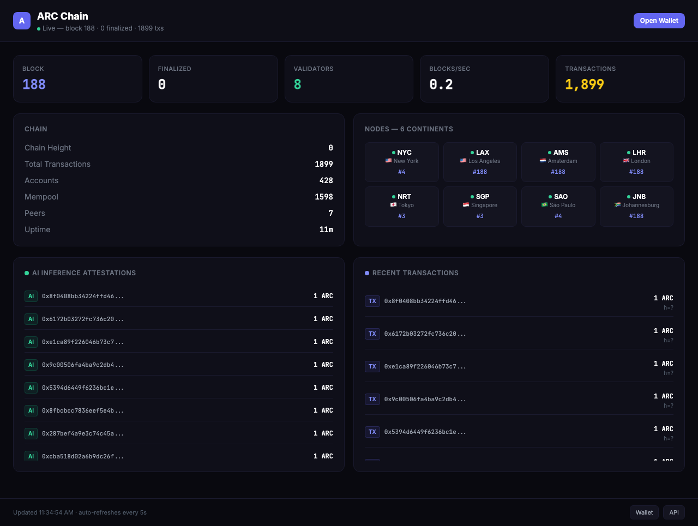
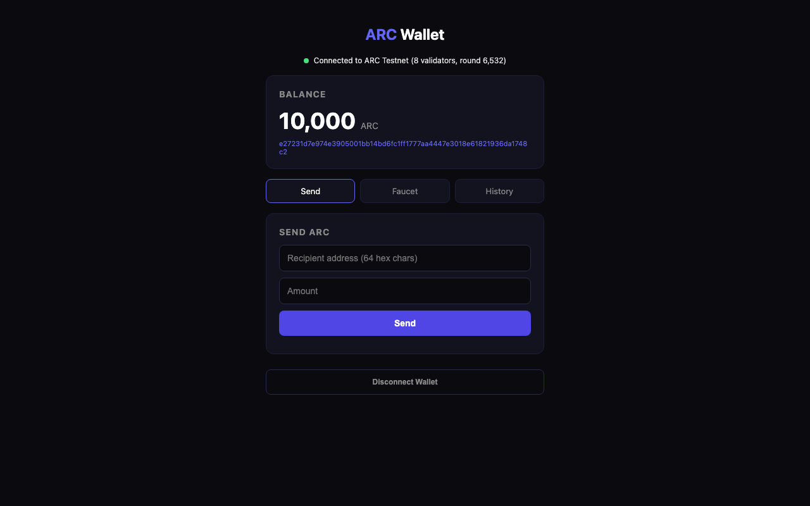
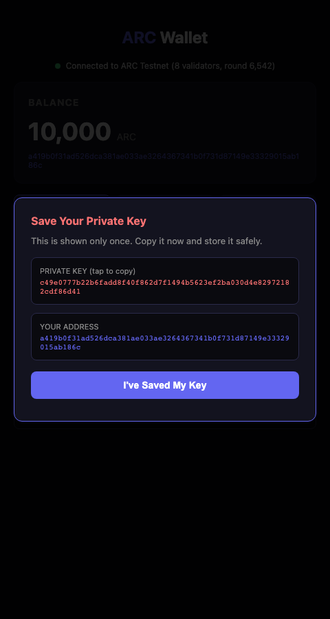

# ARC Chain — Testnet

**Run a model that doesn't fit on any one of your machines, by splitting it across all of them.**

A request flows through a pipeline of nodes. Each node holds a slice of the model — a few transformer layers — and forwards the resulting hidden state to the next node via HTTP. The last node runs the LM head and returns a token. Per-row INT16 weights quantized directly from f32, pure i64 arithmetic, BLAKE3 over every wire-format hidden state. The output is bit-identical regardless of which node holds which slice, on any chip on earth.

This is how a 7B model gets shared across 7 cheap VPS, and how a 70B model gets shared across 14 of them. No single node has enough RAM. The network does.

```
                  Llama-2-7B Q4 — 32 transformer layers, ~4 GB
                              split 7 ways across the public internet

   token id           hidden state         hidden state         token id
      ↓                    ↓                    ↓                    ↑
  ┌───────┐  ─────►  ┌───────┐  ─────►   ┌───────┐  ─────►   ┌───────┐
  │ NYC   │          │ LAX   │           │ AMS   │           │ JNB   │
  │ L 0–4 │  hidden  │ L 5–9 │  hidden   │L10–13 │   hidden  │L28–31 │
  │ +EMBED│  +BLAKE3 │       │  +BLAKE3  │       │  +BLAKE3  │+LM HD │
  │ ~1 GB │          │ ~1 GB │           │ ~1 GB │           │ ~1 GB │
  └───────┘          └───────┘           └───────┘           └───────┘
       │                  │                   │                   ↑
       │                  │                   ▼                   │
       │                  │            ┌───────┐  hidden          │
       │                  │            │ LHR   │  +BLAKE3         │
       │                  │            │L14–18 │  ─────►          │
       │                  │            │ ~1 GB │                  │
       │                  │            └───────┘                  │
       │                  │                                       │
       │                  │  ──── ... ────► NRT L19–22 ────►      │
       │                  │                  SGP L23–27 ──────────┘
       │                  │
   port 9090         port 9090            port 9090           port 9090
   149.28.32.76    140.82.16.112         136.244.109.1      139.84.237.49
```

Each → is a `POST /inference/forward_shard` to the next shard's RPC. Each shard verifies the previous shard's BLAKE3 hash before computing. The last shard runs `final_norm + LM head + argmax` and returns the next token id. The coordinator collects tokens until `max_tokens` or EOS.

> **Live demo:** http://140.82.16.112:3200
> Type a prompt in the "Sharded AI" panel. Watch each shard card pulse as the activation reaches it. The trace table shows compute_ms, wall_ms, and payload bytes per hop, and the output_hash matches every replay.

## Try the full demo from your terminal

```bash
curl -sSL https://raw.githubusercontent.com/FerrumVir/arc-chain/main/scripts/arc-demo.sh | bash
```

This single command:
1. **Discovers the live shard pipeline** — prints every node, its layer range, and how much RAM it holds
2. **Runs a real Llama-2-7B inference** through the 7-shard pipeline and shows the per-hop trace (compute_ms / wall_ms / payload bytes per node)
3. **Re-runs the same prompt** and verifies the BLAKE3 hash is bit-identical (cryptographic determinism proof)
4. **Runs a different prompt** and verifies the hash is different (per-request KV cache isolation proof)
5. **Prints the install command** so you can join the network

Or, just the inference call:

```bash
curl -X POST http://149.28.32.76:9090/inference/run_sharded \
  -H 'Content-Type: application/json' \
  -d '{"input":"The largest planet is","max_tokens":15}'
```

Returns a real Llama-2-7B answer along with the full per-hop trace.

## Run a node in one command

Anyone can join the network as a community inference node. Persistent service, daily auto-update, no compile.

```bash
curl -sSL https://raw.githubusercontent.com/FerrumVir/arc-chain/main/scripts/install-community-node.sh | bash
```

The installer:
- Detects your platform (macOS arm64/x86, Linux x86_64/aarch64)
- Pulls the latest pre-built binary from the GitHub releases (currently v0.4.1)
- Downloads Llama-2-7B-Chat Q4_K_M (~4 GB) — or TinyLlama on machines with < 6 GB RAM
- Installs as a launchd / systemd service that auto-starts and auto-restarts
- Schedules a daily auto-update check at 04:17 local time

After install your node is running, joined to the testnet, contributing inference compute, and visible at the live dashboard.

Uninstall any time: `bash install-community-node.sh --uninstall`.

📖 **5-minute walkthrough:** [`docs/SERO-DEMO.md`](docs/SERO-DEMO.md) — every step of the demo with explicit timings, expected outputs, and answers for skeptics.

---

99,000+ lines of Rust. Built from scratch.

Read the paper: [On the Foundations of Trustworthy Artificial Intelligence](papers/foundations-trustworthy-ai.pdf)

---

---

## Why Build on ARC

| Feature | ARC | Everyone Else |
|---------|-----|---------------|
| **On-chain AI inference** | 76 ms/token, deterministic, identical on every chip on earth | Does not exist. Previously thought impossible. |
| **Verified inference** | Cryptographic proof that a specific model produced a specific output. Proven at 7B parameters, 700x larger than any prior ZK-verified model. Attested through multi-node DAG consensus. | No chain can verify AI inference. |
| **Agent settlements** | Zero fees forever. Agents are first-class citizens with dedicated transaction types. | No chain offers zero-fee agent transactions. |
| **Smart contracts** | Both EVM (Solidity) and WASM (Rust, C, Go) natively. Pick your stack. | One or the other, not both. |
| **Quantum resistant** | Falcon-512 + ML-DSA implemented and shipping. Not a roadmap item. | No production chain has post-quantum signatures. |
| **Multi-node TPS** | 33,230 measured with real DAG consensus over real QUIC networking. Throughput increases with more validators (DAG consensus scales horizontally). | Ethereum: ~15 TPS. Solana: ~4,000 non-vote TPS sustained. |
| **Finality** | ~24ms, 2-round DAG commit (~12ms/round) | Ethereum: ~12 min. Solana: ~400ms. |
| **MEV protection** | BLS threshold encrypted mempool. Transactions encrypted until block is committed. | Exposed or partially mitigated. |
| **Signatures** | 5 algorithms: Ed25519, Falcon-512, BLS12-381, ML-DSA, secp256k1 | 1 or 2 options. |
| **ZK proofs** | Circle STARKs (Stwo). No trusted setup. Post-quantum secure. Verified at 700x the scale of any prior ZK-ML system. | SNARKs requiring trusted setup, limited to small models. |

---

## Inference Speed

The ARC engine runs neural network inference in pure integer arithmetic. No floating-point operations. The output is bitwise identical on every CPU, GPU, and architecture on earth.

| Backend | Speed | Deterministic | Verified |
|---------|-------|---------------|----------|
| ARC engine (GPU) | **76 ms/token** | Yes, all platforms | Hash + STARK |
| ARC engine (CPU) | **139 ms/token** | Yes, all platforms | Hash + STARK |
| Standard float (candle Q4) | 175 ms/token | No | No |

The deterministic engine is **2.3x faster** than floating-point on GPU. Not slower. Faster.

Every inference produces an on-chain `InferenceAttestation` with the model hash, input hash, and output hash. Anyone can independently verify by re-executing on any hardware and comparing hashes.

Read the paper: [On the Foundations of Trustworthy Artificial Intelligence](papers/foundations-trustworthy-ai.pdf)

---

## Measured Performance

| Metric | Value | Conditions |
|--------|-------|------------|
| Single-node peak TPS | **183,000** | CPU verify + sequential exec, M2 Ultra |
| Multi-node sustained TPS | **33,230** | 2 validators, real QUIC, real DAG consensus |
| Peak TPS | **350,000** | 1-second burst window |
| Commit rate | **100%** | 500K/500K transactions committed |
| GPU Ed25519 verify | **379,000/sec** | Metal compute shader |
| Inference (GPU) | **76 ms/token** | Deterministic INT16, M2 Ultra |
| Inference (CPU) | **139 ms/token** | Deterministic INT16, M2 Ultra |
| DAG finality | **~24ms** | 2-round commit rule (~12ms/round) |

All numbers measured on Apple M2 Ultra (24 cores, 64 GB).

---

## Distributed Inference — 6× Faster, Cryptographically Verifiable

**The pitch:** Same model running on N devices in parallel. Same prompt → identical `output_hash` on every device. N× throughput vs single-machine inference.

**Live demo (no install needed):**

1. Open [http://140.82.16.112:3200](http://140.82.16.112:3200) — the dashboard
2. Click any inference node card → runs inference on that specific device
3. Click **⚡ Run Live Benchmark** → measures sequential vs distributed speedup in real time
4. Verify all devices produce the same hash for the same prompt

**Or from your terminal:**

```bash
git clone https://github.com/FerrumVir/arc-chain.git && cd arc-chain

# Distribute 10 inference requests across 5 nodes in parallel
./scripts/inference-router.sh 10 "What is 2+2?"

# Side-by-side benchmark: 1 node sequential vs 5 nodes parallel
./scripts/inference-benchmark.sh 10
```

**Benchmark results (10 inferences, TinyLlama 1.1B):**

| Mode | Time | Throughput |
|------|------|-----------|
| Sequential (1 node) | 213.5s | 0.04 req/s |
| Distributed (5 nodes) | 34.4s | **0.29 req/s** |
| **Speedup** | | **6.2× faster** |

All 20 responses (10 sequential + 10 distributed) produced **identical** `output_hash`. Different physical machines, same cryptographic proof.

### How distribution works

Each inference-enabled seed loads the same GGUF model. The router script dispatches requests round-robin across all of them. Each device runs its inference fully and independently — no inter-node communication during inference. The "distribution" is at the request level (load balancing across replicas), not layer level.

**Why it's faster:** A single 2-core VPS processes inferences serially. With 5 replicas, 5 inferences run simultaneously. Throughput scales linearly with the number of replica devices.

**Why it's verifiable:** Every response includes an `output_hash` (BLAKE3 of token bytes). Same model file + same prompt = byte-identical output_hash across all devices. Anyone can re-run any inference on their own hardware to verify the result.

### Upload your own model to a node

To add a new inference node to the network:

```bash
# Option 1: One command (downloads pre-built binary, your model, joins testnet)
curl -sSL https://raw.githubusercontent.com/FerrumVir/arc-chain/main/scripts/sero-quickstart.sh \
  | bash -s -- /path/to/your-model.gguf

# Option 2: Existing testnet seed with your own model
ssh root@your-seed-ip
cd /root/arc-chain
# Upload your .gguf model
scp local-model.gguf root@your-seed-ip:/root/arc-chain/model.gguf
# Restart node with --model flag
screen -S arc -X quit
screen -dmS arc ./target/release/arc-node \
  --rpc 0.0.0.0:9090 --p2p-port 9091 \
  --validator-seed YOUR_NAME \
  --seeds-file testnet-seeds.txt --genesis genesis.toml \
  --stake 5000000 --eth-rpc-port 0 \
  --model model.gguf
```

After your node loads the model (~2-30s depending on model size), it shows up in the dashboard's distributed inference grid. Add its IP to `inference-router.sh` to include it in the round-robin pool.

### Run your model alongside others (sharded throughput)

If you have a beefy machine and want to multiply network throughput:

```bash
# 1. Get the same TinyLlama model the seeds use
curl -L -o model.gguf https://huggingface.co/TheBloke/TinyLlama-1.1B-Chat-v1.0-GGUF/resolve/main/tinyllama-1.1b-chat-v1.0.Q4_K_M.gguf

# 2. Run quickstart with that model
./scripts/sero-quickstart.sh ./model.gguf

# 3. The benchmark script will pick up your node automatically (it round-robins
#    across all reachable inference-enabled nodes — edit NODES list if needed)
./scripts/inference-benchmark.sh 10
```

Your machine joins the inference pool. The next benchmark run distributes requests across all participating devices, including yours. You contribute to network throughput AND every inference you serve gets cryptographically attested on-chain.

---

## Run a Node — One Command

**Zero compile. Zero setup.** Pre-built binary downloads, auto-configures, joins testnet as inference observer. Bring any GGUF model.

```bash
curl -sSL https://raw.githubusercontent.com/FerrumVir/arc-chain/main/scripts/sero-quickstart.sh | bash -s -- /path/to/your-model.gguf
```

That's it. Your node:
- Downloads the pre-built binary (16 MB) from GitHub releases
- Auto-detects platform (macOS/Linux, arm64/x86_64)
- Connects to 8 testnet seeds across 6 continents
- Loads your GGUF model (Llama, Mistral, Phi, Gemma, Qwen — anything)
- Starts serving inference with on-chain attestations

No git clone, no Rust toolchain, no 15-minute compile.

**No model? It downloads TinyLlama 1.1B for you:**
```bash
curl -sSL https://raw.githubusercontent.com/FerrumVir/arc-chain/main/scripts/sero-quickstart.sh | bash
```

**Check it's working:**
```bash
curl http://localhost:9944/health
# {"status":"ok","version":"0.3.1","peers":8,"dag_round":1234,"validators":9}
```

### Build From Source (optional)

If you want to compile yourself:

```bash
git clone https://github.com/FerrumVir/arc-chain.git && cd arc-chain
./scripts/join-inference.sh                                    # default TinyLlama
./scripts/join-inference.sh --model ~/models/llama-3-8b.gguf  # bring your own
```

Your node connects to the live testnet, loads the model, and starts serving inference. That's it.

**Test it works (one command):**
```bash
./scripts/test-inference.sh "What is 2+2?"
```
This runs inference, shows the output, and prints the cryptographic hashes + on-chain attestation tx hash.

**Check on-chain attestations:**
```bash
./scripts/check-attestations.sh                       # Your local node
./scripts/check-attestations.sh 140.82.16.112:9090 10 # Remote node, last 10
```

**Raw curl (if you prefer):**
```bash
# Run inference
curl -X POST http://localhost:9944/inference/run \
  -H 'Content-Type: application/json' \
  -d '{"input":"[INST] What is 2+2? [/INST]","max_tokens":32}'

# See all attestations on the network
curl http://140.82.16.112:9090/inference/attestations?limit=10
```

**Response fields:**
- `output` — the model's response
- `output_hash` — BLAKE3 hash of the output (deterministic, verifiable)
- `model_hash` — identifies exactly which model produced it
- `attestation.tx_hash` — on-chain tx proving this inference happened
- `ms_per_token` — speed

**Verify determinism:** Run the same prompt on two different machines. The `output_hash` will be **bit-for-bit identical**. That's the whole point — any machine can independently verify any inference.

### Already have the repo cloned?

```bash
cd arc-chain
./scripts/join-inference.sh                           # Default model
./scripts/join-inference.sh --model ~/my-model.gguf   # Your model
```

### What does it cost?

Nothing. There is no subscription. No account. No sign-up. You run a binary on your own machine and you earn ARC for contributing compute to the network. The node software is open source.

| Resource | Requirement |
|----------|-------------|
| **RAM** | 2 GB minimum, 4 GB+ for inference |
| **Disk** | 2 GB for build, ~4 GB with model |
| **CPU** | Any (x86, ARM, Apple Silicon all work) |
| **GPU** | Optional (Metal, CUDA, or Vulkan for faster inference) |
| **OS** | Linux or macOS |
| **Network** | Any internet connection |
| **Cost** | Free. Forever. |

---

## Quick Start (no install)

Don't want to run a node? You can still use the network right now:

1. Open the **[Web Wallet](http://140.82.16.112:3100)** in your browser (phone or desktop)
2. Click **"Create New Wallet"** — save your private key
3. You now have **10,000 ARC** — send tokens, check balance, explore
4. View the live network on the **[Dashboard](http://140.82.16.112:3200)** — 8 nodes across 6 continents

**Live Dashboard:** [http://140.82.16.112:3200](http://140.82.16.112:3200)
**Web Wallet:** [http://140.82.16.112:3100](http://140.82.16.112:3100)



| Web Wallet | Private Key (copyable) |
|:---:|:---:|
|  |  |

```bash
# Quick test from terminal — zero install needed
curl http://140.82.16.112:9090/stats

# Claim free testnet tokens
curl -X POST http://140.82.16.112:9090/faucet/claim \
  -H 'Content-Type: application/json' \
  -d '{"address":"your-64-char-hex-address-here"}'
```

---

## Network Endpoints

**All 8 testnet nodes** have the same API on port 9090:

| Node | Location | RPC |
|------|----------|-----|
| NYC | New York | `http://149.28.32.76:9090` |
| LAX | Los Angeles | `http://140.82.16.112:9090` |
| AMS | Amsterdam | `http://136.244.109.1:9090` |
| LHR | London | `http://104.238.171.11:9090` |
| NRT | Tokyo | `http://202.182.107.41:9090` |
| SGP | Singapore | `http://149.28.153.31:9090` |
| SAO | Sao Paulo | `http://216.238.120.27:9090` |
| JNB | Johannesburg | `http://139.84.237.49:9090` |

| Endpoint | URL |
|----------|-----|
| **Chain Stats** | [/stats](http://140.82.16.112:9090/stats) |
| **Node Health** | [/health](http://140.82.16.112:9090/health) |
| **Validators** | [/validators](http://140.82.16.112:9090/validators) |
| **Inference Attestations** | [/inference/attestations](http://140.82.16.112:9090/inference/attestations) |
| **Account Lookup** | `/account/{address}` |
| **Faucet** | `POST /faucet/claim` |
| **Run Inference** | `POST /inference/run` |
| **DAG Sync State** | `/sync/dag_state` |

> **Your node's ports**: RPC on 9944, P2P on 9945 (both configurable). The live testnet uses 9090 (legacy).

### Makefile shortcuts

```bash
make join            # Join testnet (validator only)
make inference       # Join with inference enabled
make stats           # Check live chain stats
make health          # Check live node health
make test            # Run all tests
make explorer        # Open block explorer
```

### Get testnet tokens

**Easiest:** Open the [Web Wallet](http://140.82.16.112:3100) and create a wallet. You get 10,000 ARC automatically.

**From terminal:**
```bash
curl -X POST http://localhost:9944/faucet/claim \
  -H 'Content-Type: application/json' \
  -d '{"address":"your-wallet-address"}'
```

### Deploy a smart contract

Write Solidity (EVM via revm 19) or Rust/C/Go (WASM via Wasmer 6.0). Both VMs run natively. Choose whichever fits your stack.

### Run AI agents

Three agent types ship with the chain. All agent settlements are zero-fee.

```bash
cd agents && cargo run --release
```

- **Oracle agent** - submits inference attestations with economic bonds
- **Router agent** - routes inference requests to capable nodes
- **Sentiment agent** - on-chain sentiment analysis via deterministic inference

Agents register on-chain via `RegisterAgent` (0x07) and settle via `Settle` (0x06) at zero cost. ARC is built for agents.

---

## Dual VM: EVM + WASM

Deploy in whichever runtime fits your project:

| Runtime | Language | Engine | Use Case |
|---------|----------|--------|----------|
| **EVM** | Solidity, Vyper | revm 19 | Ethereum-compatible dApps, DeFi, existing tooling |
| **WASM** | Rust, C, C++, Go, AssemblyScript | Wasmer 6.0 | High-performance compute, custom logic, ML models |

Both VMs have access to 11 native precompiles: BLAKE3, Ed25519, VRF, Oracle, Merkle proofs, BlockInfo, Identity, Falcon-512, ZK-verify, AI-inference (0x0A), BLS-verify.

---

## Transaction Types (24)

| Type | Code | Description |
|------|------|-------------|
| Transfer | `0x01` | Send ARC between accounts |
| Stake | `0x02` | Stake ARC to become a validator |
| Unstake | `0x03` | Begin unstaking with cooldown |
| Deploy | `0x04` | Deploy WASM or EVM smart contract |
| Call | `0x05` | Call a deployed contract |
| **Settle** | **`0x06`** | **Zero-fee AI agent settlement** |
| **RegisterAgent** | **`0x07`** | **Register an AI agent on-chain** |
| Governance | `0x08` | Submit or vote on governance proposal |
| Bridge Lock/Unlock | `0x09-0x0B` | Cross-chain bridge operations |
| Channel Open/Close | `0x0C-0x0E` | Payment channel lifecycle |
| ShardProof | `0x15` | Submit STARK proof of computation |
| **InferenceAttestation** | **`0x16`** | **Attest to inference result with bond** |
| **InferenceChallenge** | **`0x17`** | **Challenge an attestation (dispute)** |
| InferenceRegister | `0x18` | Register validator inference capabilities |
| + 10 more | | Batch, social recovery, state rent, etc. |

Agent transactions (bold) are unique to ARC.

## Cryptographic Signatures

Five signature algorithms, production ready:

| Algorithm | Use | Speed |
|-----------|-----|-------|
| **Ed25519** | Primary signing | 118K sigs/sec |
| **Falcon-512** | Post-quantum (NIST) | Production |
| **BLS12-381** | Aggregate N sigs into 1 verify | Production |
| **ML-DSA** | Post-quantum (NIST Dilithium) | Production |
| **ECDSA secp256k1** | Ethereum compatibility | Production |

Your contracts and agents can use any of these. Post-quantum ready today.

## Smart Contract Standards

| Standard | Description |
|----------|-------------|
| **ARC20** | Fungible token (ERC-20 equivalent) |
| **ARC721** | NFT (ERC-721 equivalent) |
| **ARC1155** | Multi-token (ERC-1155 equivalent) |
| **UUPSProxy** | Upgradeable proxy pattern |
| **ARCStaking** | Staking with tier system |
| **ArcBridge** | Cross-chain bridge |
| **ArcStateRoot** | State root commitments for rollups/L2s |

## Inference Tiers

Three tiers of AI inference, each with different trust/cost tradeoffs:

| Tier | Execution | Verification | Use Case |
|------|-----------|-------------|----------|
| **Tier 1** | On-chain (precompile 0x0A) | Every validator re-executes | Small models, full trust |
| **Tier 2** | Off-chain, optimistic | Fraud proofs + economic bonds | Large models, fast |
| **Tier 3** | Off-chain, STARK-proven | Cryptographic proof | Maximum trust |

---

## Distributed Inference (v0.3.0)

Run models that no single device could handle. A 670B model splits across nodes that each hold a piece and compute in parallel. You go from "can't run it" to running it at full quality.

**How it works:**

```
Your laptop (layers 0-10)  -->  Friend's PC (layers 11-20)  -->  ...  -->  Gaming rig (final layers)
    embed + compute               receive activations,              run last layers,
    forward activations           compute, forward                  produce output token
```

Every activation is i64 fixed-point, serialized as little-endian bytes with a BLAKE3 integrity hash. The output is **mathematically identical** to running on a single machine. Not similar. Identical. Bit for bit.

**For MoE (Mixture of Experts) models:** Experts compute simultaneously across nodes, not sequentially. More devices = more throughput. Speed scales with participants.

**Deterministic caching:** Identical inputs always produce identical outputs (integer-only arithmetic). Repeated queries are instant across the entire network. The more people join, the faster and cheaper it gets.

| Feature | Detail |
|---------|--------|
| **Sharding** | Pipeline-parallel at transformer layer boundaries |
| **MoE** | Expert-parallel, round-robin assignment across nodes |
| **Activation size** | 64 KB per layer boundary per token (d_model=8192) |
| **Network overhead** | ~30ms per token over consumer internet (6 hops) |
| **Integrity** | BLAKE3 hash on every activation transfer |
| **Determinism** | Bit-for-bit identical: x86, ARM, GPU, any device |
| **Verification** | VRF committee + challenge-response fraud proofs |

---

## ARC Token

ARC exists today as an ERC-20 on Ethereum: [`0x672fdba7055bddfa8fd6bd45b1455ce5eb97f499`](https://etherscan.io/token/0x672fdba7055bddfa8fd6bd45b1455ce5eb97f499)

When ARC Chain mainnet launches, ERC-20 holders will migrate to native ARC tokens via a bridge contract. Fixed supply of 1.03B ARC. No tokens are ever burned. No inflation.

On testnet, use the faucet to get test tokens and start building now.

---

## RPC API (34 endpoints)

| Method | Endpoint | Description |
|--------|----------|-------------|
| GET | `/health` | Node health, peers, uptime |
| GET | `/stats` | Block height, TPS, total transactions |
| GET | `/info` | Chain info, GPU status |
| GET | `/block/latest` | Latest block |
| GET | `/block/{height}` | Block by height |
| GET | `/blocks?from=&to=&limit=` | Paginated block list |
| GET | `/account/{address}` | Account state |
| GET | `/account/{address}/txs` | Transaction history |
| POST | `/tx/submit` | Submit signed transaction |
| POST | `/tx/submit_batch` | Batch submission |
| GET | `/tx/{hash}` | Transaction with receipt |
| GET | `/tx/{hash}/proof` | Merkle inclusion proof |
| GET | `/validators` | Current validator set |
| GET | `/agents` | Registered AI agents |
| POST | `/inference/run` | Run inference (returns output + hash + ms/token) |
| GET | `/inference/attestations` | All on-chain attestations |
| POST | `/faucet/claim` | Claim testnet tokens |
| GET | `/faucet/status` | Faucet status |
| GET | `/sync/snapshot` | State sync for new nodes |
| POST | `/contract/{address}/call` | Call a smart contract |
| GET | `/channel/{id}/state` | Payment channel state |
| POST | `/eth` | ETH JSON-RPC (blockNumber, getBalance, call, estimateGas, getLogs) |

---

## Codebase

**99,600+ lines of Rust** across 16 crates with **1,196 tests**.

| Crate | LOC | Tests | What It Does |
|-------|-----|-------|-------------|
| `arc-types` | 14,490 | 244 | 24 transaction types, blocks, accounts, governance, staking, bridge, inference |
| `arc-state` | 13,203 | 154 | DashMap state, Jellyfish Merkle Tree, WAL, BlockSTM parallel execution, GPU cache |
| `arc-crypto` | 11,680 | 230 | Ed25519, secp256k1, BLS, BLAKE3, Falcon-512, ML-DSA, VRF, STARK prover |
| `arc-olm` | 9,760 | 55 | On-chain language model runtime, INT16 deterministic inference |
| `arc-vm` | 8,439 | 145 | Wasmer WASM + revm EVM, gas metering, 11 precompiles, AI inference oracle |
| `arc-node` | 8,424 | 61 | Block production, RPC (34 endpoints), consensus manager, STARK proofs |
| `arc-consensus` | 7,971 | 137 | DAG consensus, 2-round finality, slashing, VRF, epoch transitions |
| `arc-bench` | 5,336 | - | 10 benchmark binaries |
| `arc-gpu` | 5,250 | 64 | Metal/WGSL Ed25519 batch verify (379K/sec), GPU memory, buffer pool |
| `arc-net` | 2,355 | 26 | QUIC transport, shred propagation, FEC, gossip, peer exchange |
| `arc-relayer` | 1,076 | - | Bridge relayer between Ethereum and ARC Chain |
| `arc-agents` | 1,061 | - | Sentiment, oracle, and router AI agent examples |
| `arc-mempool` | 876 | 17 | Lock-free queue, deduplication, BLS threshold encrypted mempool |
| `arc-inference` | 620 | 53 | INT16 runtime (default), VRF committee selection, EIP-1559 inference gas lane |
| `arc-channel` | 480 | 10 | Off-chain payment channels, BLAKE3 state commitments |
| `arc-cli` | 660 | - | CLI: keygen, RPC, transaction submission |

Plus: Python SDK (2,688 LOC), TypeScript SDK (2,011 LOC), Solidity contracts (1,944 LOC), block explorer.

---

## Staking (Coming to Mainnet)

Staking is implemented in the protocol but not yet active on testnet. Right now, anyone can:
- Run a node and join the testnet
- Deploy smart contracts (EVM or WASM)
- Run deterministic inference
- Test all 24 transaction types
- Run AI agents with zero-fee settlements
- Use the faucet for test tokens

---

## What's Done

Everything below is implemented, deployed, and running on the live testnet:

| Feature | Status | Details |
|---------|--------|---------|
| DAG consensus (2-round commit) | Live | 8 nodes, 6 continents, matching block hashes verified |
| EVM (Solidity) | Live | revm 19, deploy + execute contracts, ETH JSON-RPC |
| WASM (Rust/C/Go) | Live | Wasmer 6.0 runtime |
| Deterministic inference | Live | INT16 + GGUF backends, 76 ms/token GPU (32,767 levels per weight, deterministic) |
| Data availability | Live | Reed-Solomon erasure coding, DAS sampling |
| Validator slashing | Live | Equivocation, liveness, invalid proposals |
| State sync | Live | Chunked snapshots with BLAKE3 verification |
| Cross-shard transactions | Live | 2-phase lock/commit protocol |
| DAG persistence (WAL) | Live | Segmented WAL files, survives restarts |
| Web wallet | Live | [http://140.82.16.112:3100](http://140.82.16.112:3100) |
| 5 signature algorithms | Live | Ed25519, Falcon-512, BLS, ML-DSA, secp256k1 |
| Encrypted mempool | Live | BLS threshold commit-reveal |
| Block explorer | Live | `explorer/index-live.html` |

## Roadmap (What's Next)

| Priority | Feature | Description |
|----------|---------|-------------|
| 1 | HTTPS for wallet | TLS certificate for the web wallet (currently HTTP) |
| 2 | Mobile wallet | Native Android/iOS app or PWA |
| 3 | DAG WAL replay | Replay persisted DAG blocks on node restart for faster recovery |
| 4 | Load testing | Prove 30K+ TPS with real signed transfers through DAG consensus |
| 5 | Desktop app | Electron or Tauri app for Mac/Windows/Linux |
| 6 | SDK improvements | Python + TypeScript SDK with wallet, signing, contract deployment |
| 7 | Mainnet preparation | Genesis ceremony, validator onboarding, bridge contract |

---

## Disclaimer

ARC Chain is in active development. This is a testnet. Do not use real funds. The software is provided as-is with no warranty. Smart contracts deployed on testnet may not persist across upgrades. The ARC token economics described here reflect current design and may change before mainnet.

---

## License

Open source in spirit. All source code is public. Read it, learn from it, build with it.

**What you can do:**

- Use ARC for any project if your org is under $10M revenue. Full production rights. No approval needed.
- Build anything on the ARC chain at any scale, any revenue. Contracts, tokens, agents, L2s, rollups, subnets. If it runs on ARC, it's free forever.
- Join the ARC ecosystem. Crypto projects of any size, any market cap. If you want to build on ARC, deploy on ARC, or integrate with ARC, you are welcome. We want you here.
- Run a validator, node, or inference provider. Always free.
- Use it for research, education, personal projects. Always free.
- Fork it, modify it, experiment with it.

If your org is over $10M revenue and you want to use the code outside the ARC ecosystem, reach out for a commercial license (starts at $50K/year). We're friendly about it: tj@arc.ai

**What you can't do:**

- Fork this codebase and launch a competing L1 blockchain
- Extract components (consensus, inference, crypto) to use in a competing network
- Repackage or rebrand this code as your own chain

I built this solo from scratch, every line. I just don't want to see it taken and passed off as someone else's work. Everything else is fair game. If you want to work together on something, I'm open to it: tj@arc.ai

Becomes fully open source (Apache 2.0) on March 25, 2030. See [LICENSE](LICENSE) for details.
