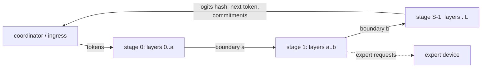

# Regional swarm runtime: one model across ordinary nodes, bit-exact

Status: draft (ENG-6, regional swarms; scope corrected 7 Oct 2026). Code: `crates/arc-inference/src/modern/mla/island/`,
CLI `arc-island` (`crates/arc-inference/src/bin/arc_island.rs`), process tests
`crates/arc-inference/tests/island_processes.rs`, CI `.github/workflows/island-runtime.yml`.
Measured results and the labelled Kimi K2 projection: [`RESULTS.md`](RESULTS.md).

Nothing here changes the network's canonical model, consensus, rewards or native
inference, and nothing here talks to a node. It builds on the MLA + MoE integer
profile `arc.hf-deepseek-v3.mla-moe.i8-dyadic-row.q16.v1` (ENG-5, PR #156) and
calls its `StageModel::forward` unchanged.

## Why

The deployment target is many ordinary community nodes (typically 16 GB RAM),
connected over the public internet within a measured-RTT region. TJ's planning
assumption of about 600 GB of K2.6 weights means roughly 40+ stages or expert
groups, with additional capacity for KV, logs and redundancy. Large-memory
machines can participate but are never required. ENG-7 owns formation and
capacity/economic simulation. ENG-8, ENG-9 and ENG-1 own speculation, latency
engineering and batched kernels. No measured Kimi speed is claimed here.

See [REGIONAL-SWARM.md](REGIONAL-SWARM.md) for replica failover, draft trees,
placement interfaces, regional CI budgets and remaining deployment limits.
The `island` module and CLI names are retained for source compatibility.

## Shape



* **Stage worker** (`worker.rs`). Holds layers `[a, b)` of a stage package (or a
  sub-range of a whole-model package). For every item of a frame, in order, it
  runs each position through `StageModel::forward`, records the activation hash
  at every layer boundary it covers, appends that commitment to the item, logs
  its input, and forwards. The last stage selects the next token with the
  sequence's selection rule (argmax or the RP64 repetition penalty).
* **Coordinator** (`coordinator.rs`). The ingress, co-located with stage 0.
  Continuous admission; `G` micro-batches in flight, `B` sequences spread over
  them; chunked prefill; per-sequence ledger of every stage's commitments.
* **Expert parallelism** (`expert.rs`, `ExpertPool` in `model.rs`). A stage's
  routed experts spread over devices (expert `e` on device `e mod D`). The
  stage evaluates its own and the shared experts while the others return exact
  `i128` partial sums `Σ w_e·y_e`; the sum is shifted once (spec §5.6). One round
  trip per contacted device per MoE layer per position. Explicit expert-owner
  maps support regional placement; the cost of these RPCs must be measured.
* **Transport** (`transport.rs`). `Transport` / `Listener` / `Link` traits.
  `TcpTransport` (length-prefixed frames, Nagle off) is the first; RDMA or
  Thunderbolt implementations plug into the same traits. `MemTransport` joins
  threads in tests. `ShapedTransport` emulates a wide-area hop for benchmarks.
* **Wire** (`wire.rs`). Frames `Step`, `Close`, `Reveal`, `Ping`, `Shutdown`,
  `Error`. Activations travel in the narrowest lossless width per vector
  (`i8`/`i16`/`i32`/`i64`), so the receiver hashes exactly the integers the
  sender produced. On the synthetic models every boundary fits `i32` (half of
  `i64`); `i16` or `i8` is never used unless every value fits.

## Exactness

The engine is integer-only, and each sequence runs on its own KV cache: every
position passes every layer in order, whatever the split, the process count, the
concurrency, the micro-batch layout or the prefill chunking. So an island's
tokens, every logits hash and the hash at every layer boundary of every position
equal the single process's `StageModel::generate`. The tests prove it on threads
(every split of the 4-layer models, 3 expert formats, tied routers, 6 schedules)
and on separate processes over TCP (1, 2 and 4 processes, uneven splits), and the
benchmark re-checks every run. Expert parallelism is exact because integer
partial sums add up exactly in any grouping.

## Commitments and verification (research-6 §4.2)

For every position, stage `[a, b)` commits `b − a + 1` hashes: the activation
hash (`BLAKE3` of the Q16 values as LE `i64`, spec §6.2) of its input boundary,
then of each layer's output. The last stage (the one with the LM head) also
commits every position's logits hash and the token it selected at each item's
last position. The coordinator takes the generated token and the logits hashes
from that commitment, so the token the run continues with is always one the
last stage committed to. The coordinator's `Ledger` per sequence:

* **Link check.** Stage `s+1`'s input hash is computed from the bytes it
  received; it must equal stage `s`'s committed output hash. A stage that sends
  one thing and commits another is caught here (test: *a lying commitment*).
* **Split invariance.** `Ledger::boundary_digests()` (per boundary, BLAKE3 over
  the positions' hashes) equals `generate`'s `boundary_digests` for every split.
* **Stage record.** `Ledger::stage_root(seq, a, b)`: BLAKE3 over a domain tag,
  the sequence, the range and every committed hash (and, for the last stage,
  every logits hash and selected token); the 32 bytes a stage would sign and
  post per epoch (signing is not part of this change).

**Audit** (`commit::audit_stage`). A verifier holding only layers `[a, b)`
requires an `AuditContext` captured from its original `Request` and accepted
output transcript, independently of the reveal. It checks revealed sequence,
prompt boundary, token history and selection against that context, re-executes
the stage using the revealed activations and trusted tokens, and compares every
committed hash. For the last stage it also recomputes every logits hash and
re-applies the trusted selection rule and accepted history to
every committed token (research-6 §4.2.2: the output tokens must equal the
selection rule applied to the logits). Exact arithmetic makes the verdict
decisive, with no thresholds:

* `Valid`;
* `RequestMismatch{field}`: revealed metadata differs from the trusted request;
* `InputMismatch{position}`: the reveal does not hash to the committed input;
* `Fault{position, boundary}`: the first boundary that differs;
* `LogitsMismatch{position}`: the last stage's logits hash differs;
* `WrongToken{position, committed, expected}`: the last stage emitted a token
  its selection rule does not give for these logits;
* `ForwardMismatch{position}`: a forwarded or final emitted token differs from
  the verifier's accepted transcript;
* `Refused`: required trusted evidence is absent/inconsistent or shapes are invalid.

`audit_all` also requires a complete, nonempty ledger and exactly one reveal
for every committed stage. See [AUDIT-CONTEXT.md](AUDIT-CONTEXT.md) for the
breaking API/wire change and consumer migration.

Tests, on threads and on separate processes: a stage that alters an output and
commits the altered hash keeps every link consistent and is blamed at that
position and boundary; a last stage that emits a wrong token (every hash
honest) is blamed with `WrongToken` at that position; an altered reveal gives
`InputMismatch`; a lying commitment breaks the link check.

## Recovery

The activation log is the audit log and the recovery log in one (research-6
§4.3). With `--log-dir`, a stage appends every item it ran (inputs and committed
hashes) and every close. A restarted stage replays the log to rebuild each open
sequence's KV cache, checks that replay reproduces every hash it committed
before the crash (else it refuses to start), drops a torn last record, and
listens on the same address; the upstream stage notices the dead connection
before sending and reconnects. Test: a stage process killed with SIGKILL
between two decode steps of a generation (no frame in flight), restarted, and
the run finishes byte-identically (stage 0, a middle stage and the last stage
each tried).

Limit: recovery covers a crash **between steps** only. A crash with a frame in
flight loses that frame: the coordinator does not resend it and times out
(300 s). In-flight recovery needs the coordinator to resend and stages to treat
a repeated position as idempotent; not built yet.

## Running it

```bash
cargo build --release -p arc-inference --bin arc-island
B=target/release/arc-island
$B synth --shape small --out small.arcspkg
# Two stages on this host, then a coordinator run:
$B stage --package small.arcspkg --layers 4:8 --listen 127.0.0.1:7202 --next 127.0.0.1:7200 &
$B stage --package small.arcspkg --layers 0:4 --listen 127.0.0.1:7201 --next 127.0.0.1:7202 &
$B run --package small.arcspkg --first 127.0.0.1:7201 --listen 127.0.0.1:7200 \
       --requests requests.json --out out.json --micro-batches 2 --concurrency 8 --shutdown
# Everything above, measured, with the emulated-WAN sweep:
$B bench --package small.arcspkg --out bench.json --label "Studio lab" --kernel simd
python3 scripts/arc_island/report.py bench.json --out report.md
```

## Not in this change

* Real Kimi K2.6 weights (the converter gaps are listed in PR #156); real LAN,
  Thunderbolt or RDMA links (all measurements are loopback TCP, emulated WAN).
* Batched kernels across the sequences of a micro-batch: a stage runs items one
  after another, so micro-batching here overlaps stages and hides network delay
  but does not amortise weight reads (ENG-1's batched GEMM is on another branch).
* Tensor parallelism across processes (the exactness of the INT32 all-reduce is
  proven in-process by `tensor_and_expert_splits_are_byte_identical`).
* Signing commitments, posting stage roots on chain, beacon-driven audit
  sampling, spares and KV mirroring (research-6 §3.3, §6.5–§6.8).
